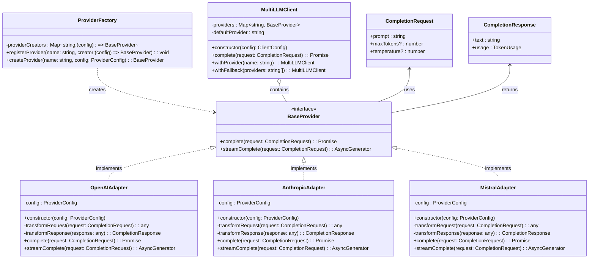

# Multi-LLM SDK

A TypeScript SDK for interacting with multiple LLM APIs (OpenAI, Anthropic, Mistral, etc.).

## Class Diagram

```mermaid
classDiagram
  %% Inheritance (Adapter pattern)
  BaseProvider <|.. OpenAIAdapter : implements
  BaseProvider <|.. AnthropicAdapter : implements
  BaseProvider <|.. MistralAdapter : implements

  %% Factory and Client relations
  ProviderFactory ..> BaseProvider : creates
  MultiLLMClient o-- BaseProvider : contains

  %% Data structures
  CompletionRequest <-- BaseProvider : uses
  CompletionResponse <-- BaseProvider : returns
  
  %% BaseProvider interface
  class BaseProvider {
    <<interface>>
    +complete(request: CompletionRequest) : Promise<CompletionResponse>
    +streamComplete(request: CompletionRequest) : AsyncGenerator
  }

  %% OpenAIAdapter
  class OpenAIAdapter {
    -config : ProviderConfig
    +constructor(config: ProviderConfig)
    -transformRequest(request: CompletionRequest) : any
    -transformResponse(response: any) : CompletionResponse
    +complete(request: CompletionRequest) : Promise<CompletionResponse>
    +streamComplete(request: CompletionRequest) : AsyncGenerator
  }

  %% AnthropicAdapter
  class AnthropicAdapter {
    -config : ProviderConfig
    +constructor(config: ProviderConfig)
    -transformRequest(request: CompletionRequest) : any
    -transformResponse(response: any) : CompletionResponse
    +complete(request: CompletionRequest) : Promise<CompletionResponse>
    +streamComplete(request: CompletionRequest) : AsyncGenerator
  }

  %% MistralAdapter
  class MistralAdapter {
    -config : ProviderConfig
    +constructor(config: ProviderConfig)
    -transformRequest(request: CompletionRequest) : any
    -transformResponse(response: any) : CompletionResponse
    +complete(request: CompletionRequest) : Promise<CompletionResponse>
    +streamComplete(request: CompletionRequest) : AsyncGenerator
  }

  %% ProviderFactory
  class ProviderFactory {
    -providerCreators : Map~string, (config) => BaseProvider~
    +registerProvider(name: string, creator: (config) => BaseProvider) : void
    +createProvider(name: string, config: ProviderConfig) : BaseProvider
  }

  %% MultiLLMClient
  class MultiLLMClient {
    -providers : Map~string, BaseProvider~
    -defaultProvider : string
    +constructor(config: ClientConfig)
    +complete(request: CompletionRequest) : Promise<CompletionResponse>
    +withProvider(name: string) : MultiLLMClient
    +withFallback(providers: string[]) : MultiLLMClient
  }

  %% Data classes
  class CompletionRequest {
    +prompt : string
    +maxTokens? : number
    +temperature? : number
  }

  class CompletionResponse {
    +text : string
    +usage : TokenUsage
  }
```